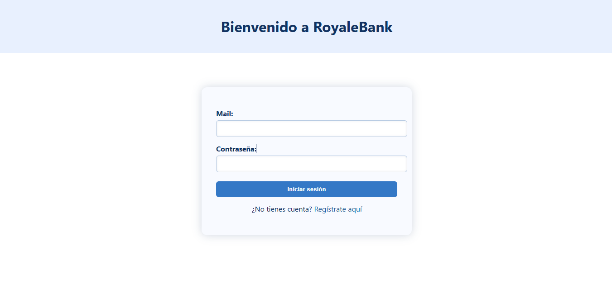
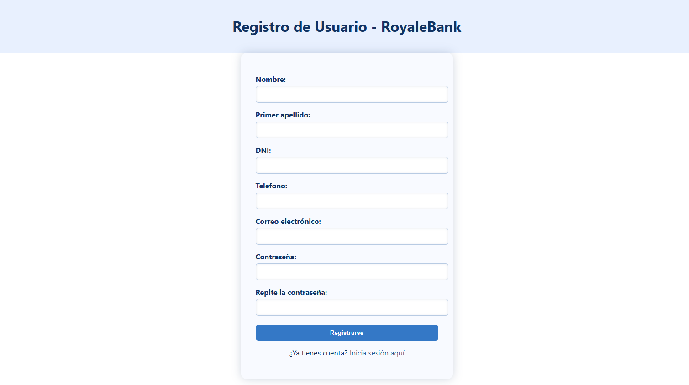
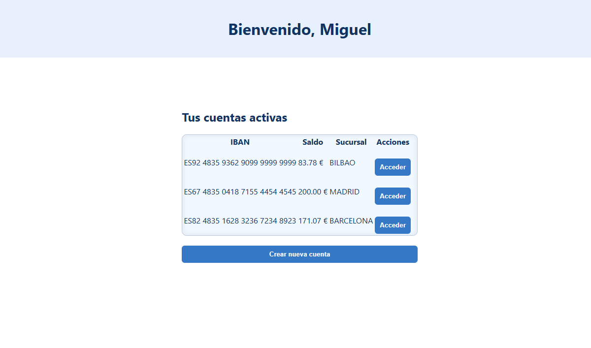
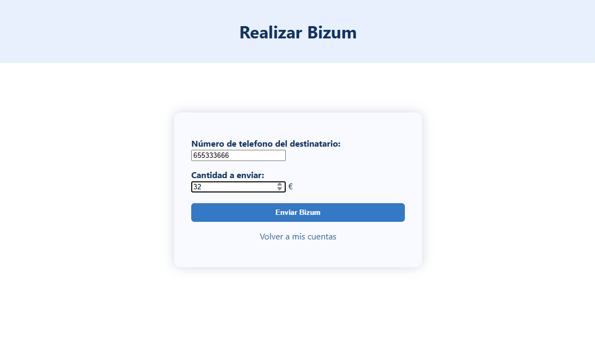
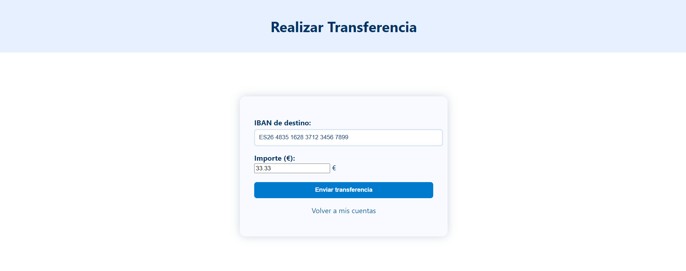

# 🏦 RoyaleBank
RoyaleBank es una aplicación bancaria moderna que hemos desarrollado como proyecto académico. La plataforma permite a los usuarios registrarse como clientes, crear y gestionar sus cuentas bancarias, y realizar operaciones como transferencias y Bizums de forma rápida y segura.

Nuestra aplicación busca simular una experiencia real de banca online, integrando funcionalidades clave tanto en el frontend como en el backend, y ofreciendo una interfaz clara y fácil de usar.

---

## 🖼️ Capturas de la aplicación y guía de uso

A continuación se muestra una serie de pantallas de nuestra aplicación **RoyaleBank**, junto con una breve explicacion de como usarla.

---

### 🔐 Iniciar sesión

Esta es la pantalla inicial que se abre al iniciar nuestra pagina. En esta pantalla, el usuario puede acceder a su cuenta introduciendo su correo electrónico y contraseña. También si todavía no es cliente puede darle al boton de registrarse para darse de alta.
Una vez autenticado el Email y contraseña se le llevara a la pagina principal.

---

### 📝 Registrarse

Los nuevos usuarios pueden darse de alta proporcionando su información personal.  
Además el formulario de registro incluye validaciones en el lado del cliente utilizando HTML. Gracias a atributos como `required`, `type`, `pattern` y validaciones de longitud, evitamos que se envíen datos mal formateados o incompletos al backend en el cual tambien verificamos estos requisitos. Esto no solo mejora la experiencia del usuario al ofrecer retroalimentación inmediata, sino que también reduce la cantidad de peticiones inválidas que llegan al servidor, optimizando así el rendimiento general de la aplicación. 

---

### 🏠 Pantalla principal (Cuentas del cliente)

Aquí se muestran todas las cuentas asociadas al cliente.  
Desde esta vista el usuario puede consultar saldos, movimientos y acceder a las funciones de **Bizum** y **transferencia**.

---

### 📲 Bizum

Funcionalidad para enviar dinero de forma rápida a otros usuarios registrados en RoyaleBank utilizando solo su número de teléfono.  
El sistema verifica que el destinatario esté registrado antes de realizar la operación.

---

### 💸 Transferencia

Desde esta sección, el cliente puede realizar transferencias bancarias entre sus cuentas o hacia cuentas de terceros dentro del sistema RoyaleBank.  
Se requiere el número de cuenta destino y el importe.

---

## 🔧 Backend

El backend de RoyaleBank está desarrollado utilizando **Spring Framework** con persistencia de datos para garantizar un manejo eficiente y seguro de la información.

### Base de datos y entidades

Este proyecto cuenta con las siguientes entidades principales:

- **Cliente**: Representa a un usuario del banco, identificado de manera única por su correo electrónico y DNI.
- **Cuenta**: Cada cuenta bancaria está asociada a un único cliente y almacena la información financiera correspondiente.
- **Pago**: Registra todas las operaciones de pago y transferencias realizadas por los clientes.
- **Token**: Utilizado para la autenticación y gestión segura de las sesiones de usuario.

---

| **Entidad** | **Atributo**       | **Descripción**                        | **Ejemplo**                   | **Clave / Restricción**             |
|-------------|-------------------|-------------------------------------|------------------------------|-----------------------------------|
| **Cliente** | cliente_id        | Identificador único del cliente      | 123                          | Clave primaria (PK)                |
|             | dni               | Documento Nacional de Identidad      | "12345678A"                  | Único y obligatorio                |
|             | nombre            | Nombre del cliente                   | "Juan"                       | Obligatorio                       |
|             | apellido          | Apellido del cliente                 | "Pérez"                      | Opcional                         |
|             | email             | Correo electrónico                   | "juan.perez@mail.com"        | Único y obligatorio                |
|             | telefono          | Número de teléfono                   | "600111222"               | Obligatorio                       |
|             | password          | Contraseña para acceso               | "Jperez123"            | Obligatorio                       |

---

| **Entidad** | **Atributo**       | **Descripción**                      | **Ejemplo**                   | **Clave / Restricción**             |
|-------------|-------------------|-----------------------------------|------------------------------|-----------------------------------|
| **Cuenta**  | cuenta_id         | Identificador único de la cuenta   | 456                          | Clave primaria (PK)                |
|             | iban              | Número IBAN único de la cuenta     | "ES9121000418450200051332"   | Único y obligatorio                |
|             | saldo             | Saldo actual de la cuenta          | 1500.75                      | Obligatorio                       |
|             | sucursal          | Sucursal bancaria                  | "MADRID_CENTRO"              | Obligatorio                       |
|             | cliente_id        | Cliente dueño de la cuenta         | 123                          | Clave foránea (FK)                 |

---

| **Entidad** | **Atributo**         | **Descripción**                     | **Ejemplo**                   | **Clave / Restricción**             |
|-------------|---------------------|-----------------------------------|------------------------------|-----------------------------------|
| **Pago**    | id                  | Identificador único del pago      | 789                          | Clave primaria (PK)                |
|             | tipo                | Tipo de pago (bizum, transferencia, pago) | "bizum"                     | Obligatorio, validado        |
|             | importe             | Monto del pago                    | 100.00                       | Obligatorio                       |
|             | cuenta_origen_id    | Cuenta desde donde se realiza el pago | 456                          | Clave foránea (FK)            |
|             | cuenta_destino_id   | Cuenta receptora del pago (opcional) | 457                          | Clave foránea (FK), puede ser nulo |
|             | concepto            | Descripción del pago              | "Pago de factura luz"         | Obligatorio                       |

---

| **Entidad** | **Atributo**     | **Descripción**                    | **Clave / Restricción**         |
|-------------|-----------------|----------------------------------|-------------------------------|
| **Token**   | id              | Identificador único del token    | Clave primaria (PK)            |
|             | cliente_id      | Cliente asociado al token        | Clave foránea (FK), relación 1 a 1 |

---

### Relaciones clave entre tablas

| **Relación**                      | **Descripción**                                                       |
|----------------------------------|---------------------------------------------------------------------|
| Cliente → Cuenta (1 a N)          | Un cliente puede tener varias cuentas, pero cada cuenta pertenece a un solo cliente. |
| Cuenta → Pago (1 a N)             | Una cuenta puede ser origen de muchos pagos.                        |
| Cuenta → Pago (0 o 1 a N)        | Una cuenta destino puede recibir muchos pagos, pero es opcional para algunos pagos. |
| Cliente → Token (1 a 1)           | Cada cliente tiene un token único para autenticación.               |
        

### Autenticación mediante cookies

Para mantener la sesión segura, el backend genera un token de autenticación que se intercambia con el cliente a través de cookies HTTP. Estas cookies están configuradas con atributos que refuerzan la seguridad, tales como `httpOnly`, que impide el acceso a la cookie desde JavaScript para proteger contra ataques de tipo XSS, y `SameSite=Lax`, que limita el envío de cookies en solicitudes cruzadas para evitar ataques CSRF. Además, la cookie es válida para todas las rutas de la aplicación, facilitando una experiencia de usuario fluida durante la sesión.

Gracias a este método, RoyaleBank garantiza una autenticación segura y eficiente, manteniendo protegida la información sensible durante la interacción del usuario con la aplicación.

## Endpoints

| Endpoint                             | Método HTTP | Request Body         | Response Body         | Códigos HTTP Principales            | Descripción                              |
|------------------------------------|-------------|----------------------|-----------------------|------------------------------------|------------------------------------------|
| `/api/royale`                      | POST        | `RegisterRequest`    | `ClientResponse`      | 201 (Creado), 409 (Conflicto)      | Registro de cliente                      |
| `/api/royale/users`                | POST        | `LoginRequest`       | Vacío                 | 201 (Creado), 401 (No autorizado)  | Login (autenticación), devuelve cookie  |
| `/api/royale/cuentas`              | POST        | `CrearCuenta`        | Vacío                 | 201 (Creado), 409, 401              | Crear cuenta bancaria                    |
| `/api/royale`                     | DELETE      | No                   | Vacío                 | 204 (Sin contenido), 401            | Logout (elimina sesión)                  |
| `/api/royale/bizum`                | POST        | `BizumRequest`       | Vacío                 | 201, 409, 404, 401                  | Bizum (transferencia por teléfono)      |
| `/api/royale`                      | GET         | No                   | `ClientResponse`      | 200 (OK), 401                      | Obtener perfil cliente                   |
| `/api/royale/transferencia`        | POST        | `TransferenciaRequest`| Vacío                | 200 (OK), 409, 404, 401            | Realizar transferencia                   |
| `/api/royale/cuenta/saldo`         | PUT         | `SaldoModRequest`    | Vacío                 | 200 (OK), 409, 404, 401            | Modificar saldo de cuenta                |
| `/api/royale/compra`               | POST        | `CompraRequest`      | Vacío                 | 200 (OK), 409, 404, 401            | Realizar compra                          |
| `/api/royale/cuentas/operaciones/{iban}` | GET   | No                   | `List<Pago>`          | 200 (OK), 404, 401                 | Listar operaciones de una cuenta         |
| `/api/royale/cuentas/{iban}`       | DELETE      | No                   | Vacío                 | 204 (Sin contenido), 404, 401      | Eliminar cuenta bancaria                 |
| `/api/royale/cliente`              | DELETE      | No                   | Vacío                 | 204 (Sin contenido), 404, 401      | Eliminar cliente                        |

## 🧪 Tests

En este proyecto se han implementado distintos tipos de pruebas automatizadas para garantizar la calidad y robustez del sistema:

### ✅ Tests Unitarios
Se han creado pruebas unitarias que validan la lógica de negocio y las restricciones de validación en clases independientes. Por ejemplo:
- **Validación de campos en el registro** (`RegisterRequest`): se comprueba que campos como DNI, email, teléfono o contraseña cumplen con las restricciones impuestas. También se testean escenarios con múltiples errores a la vez.

### 🔗 Tests de Integración
Estas pruebas validan la correcta interacción entre componentes de la aplicación y la persistencia de datos:
- **Guardar un cliente con cuentas**: se comprueba que se pueden guardar correctamente entidades `Cliente`, `Cuenta` y `Token`, así como las relaciones entre ellas.
- **Búsquedas en repositorios**: se valida que los datos guardados puedan ser recuperados correctamente por los repositorios `clientesRepository`, `cuentasRepository` y `tokenRepository`.

### 🌐 Tests End-to-End (E2E)
Se han desarrollado tests E2E usando `TestRestTemplate` para simular peticiones HTTP reales contra el servidor:
- **Registro de cliente**: se prueba el registro correcto y la detección de duplicados.
- **Login de usuario**: se comprueba que se puede iniciar sesión correctamente y se recibe una cookie de sesión válida.
- **Consulta de información del cliente**: se valida que un usuario logueado puede recuperar su perfil.
- **Creación de cuenta bancaria**: se comprueba que un cliente autenticado puede crear nuevas cuentas asociadas a su perfil.
- **Eliminación de cliente**: se testea que un cliente autenticado puede eliminar su cuenta y que los datos son eliminados correctamente.
